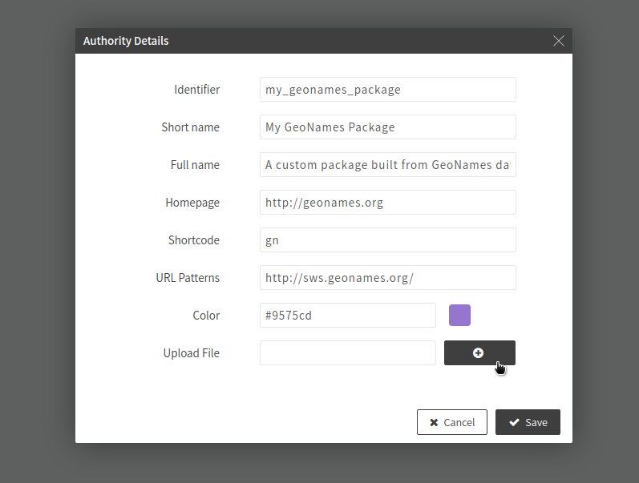

# Recogito GeoNames Packager

A utility to build custom gazetteer packages for [Recogito](https://recogito.pelagios.org) from 
[GeoNames](http://geonames.org) data.

## Compiling your own gazetteer package

Edit the `config.py` file according to your needs. Use the `countries` property to configure which countries
to include in your gazetteer file.

```python
countries = [ 'AT' ] 
```

You can also use one of the pre-configured lists as a shortcut.

```python
countries = PRESETS['SOUTH_AMERICA']
```

An empty list will create a gazetteer dumpfile with __all of GeoNames__ (see note below). 

### Download source data

Run `python download.py` to download the country data files from GeoNames.

### Build the package

Run `python convert.py` to build the gazetteer package. The result file will be in the `output` 
folder, in two versions:

- A [JSONL](http://jsonlines.org/) file, compatible with the [Linked Places specification](https://github.com/LinkedPasts/linked-places)
- A compressed copy in .gz format

### Import to Recogito

__Attention: requires admin privileges on your Recogito instance!__

On your Recogito server, go to `/admin/authorities`. Click __Add Authority File__.



Fill the gazetteer properties. You are free to select an identifier,
short name, full name, and short code and colour of your choice. For
the URL pattern, use the following (Recogito uses this to truncate
the gazetteer URIs in the UI for display purposes):

```
http://sws.geonames.org/
```

In the __upload file__ field, pick your dump file and click __Save__.

## Note to Recogito Maintainers

Note that importing large gazetteer data files to Recogito is currently a slow process. Avoid the use of a full GeoNames
dataset, if possible. Ideally, large gazetteers (>150.000 places) should be imported first, into a new & empty Recogito 
instance.

## Future work

- (Optionally?) use Wikipedia/-data links in the alternateNames dataset as a filter criterion
- Add continents and non-country features
- Include natural earth polygon shapes
- Use world continent borders from the [UCLA Geoportal](http://gis.ucla.edu/geodata/dataset/continent_ln)